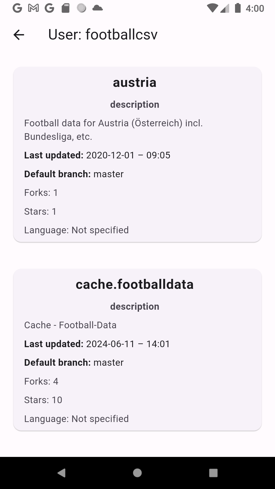

# search_git_hub

Application for searching and browsing users and their repositories in Github

Written in Flutter

Uses libraries:  

flutter_bloc, 
http, 
github_sign_in_plus
shared_preferences
intl
flutter_dotenv

***

Приложение для поиска и просмотра пользователей и их репозиториев на Github

Написано на Flutter

Использованы библиотеки:   

Uses libraries:  
flutter_bloc,
http,
github_sign_in_plus
shared_preferences
intl
flutter_dotenv

 
 
